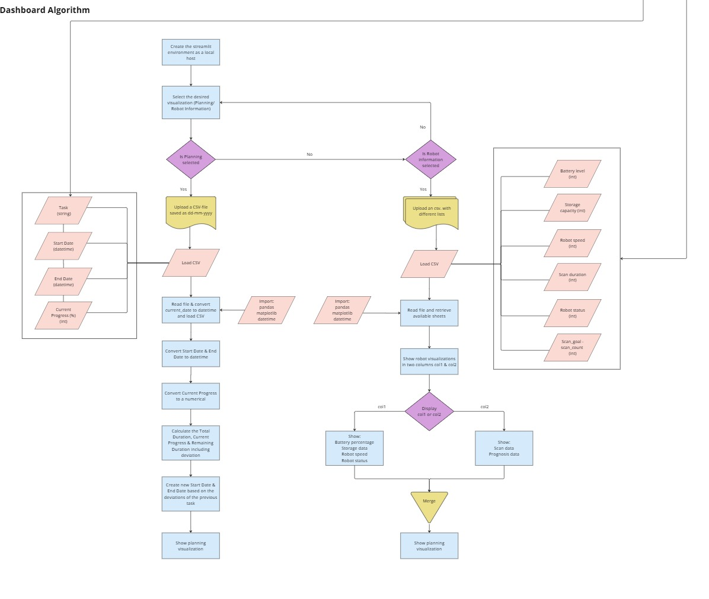
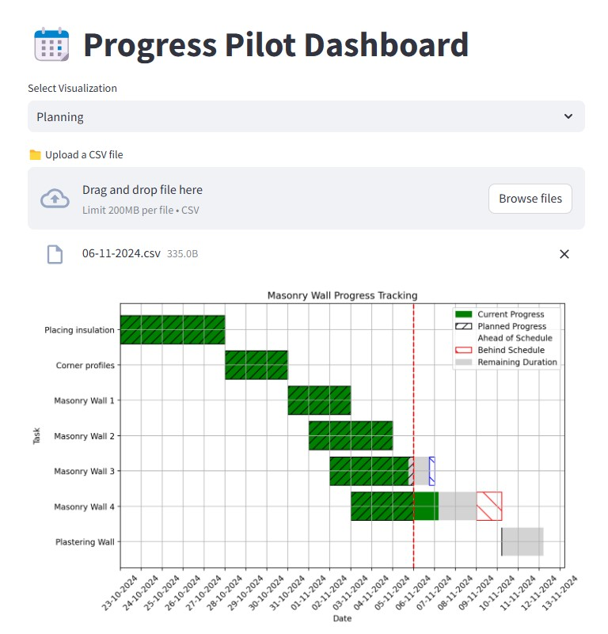
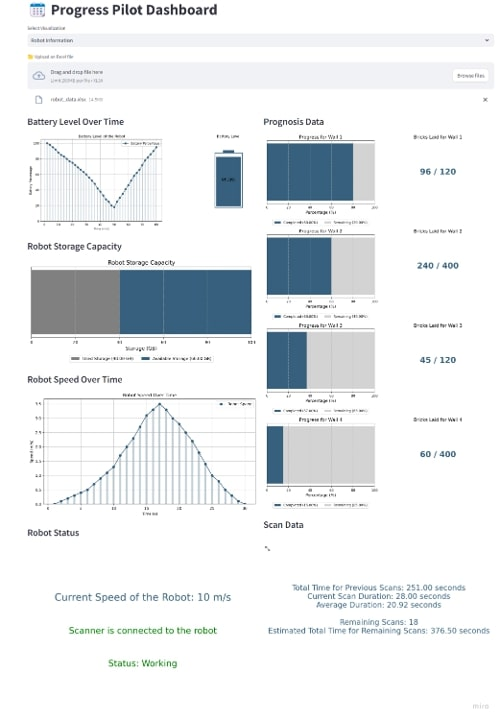

---
Run  

```bash
main_code.py 
``` 

to start the script. Then, open a Terminal and execute  


```bash
streamlit run main_code.py
```

to launch the dashboard on your local server. A localhost link will appear, which you can open in your browser. Ensure all CSV files for scheduling are uploaded with the filename format dd-mm-yyyy.csv to ensure proper functionality.

A mock-up has been created to reflect the potential exports of the robot. This data is organized in robot_data.xlsx, where each sheet represents a different type of data. Excel allows users to import a single file into the dashboard. The main script, main_code.py, calls the visualizations once robot_data.xlsx has been imported.

### Workflow:


### Visualisation planning data:


### Visualisation robot data:

