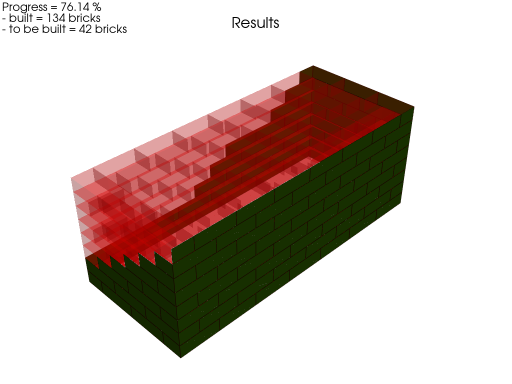
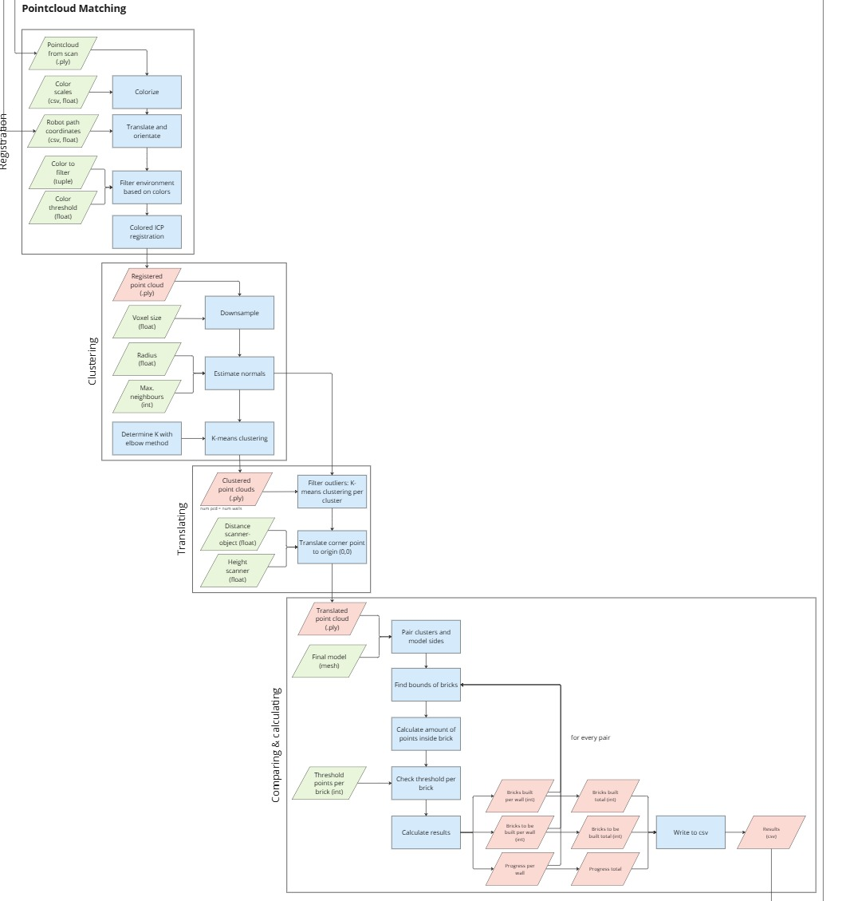

# Pointcloud Processing and Comparison

## 3.1 Pointcloud Processing

The point cloud processing step focuses on preparing the captured 3D data for further analysis and modeling. This includes several key techniques such as translation, filtering, registration, downsampling, and clustering.

### Features:
- **Translation & Orientation**: Aligns the point cloud with a reference model to ensure consistency across scans. This is achieved using the method `pcd.translate_orientate()`.
- **Ground Removal**: Filters out unwanted points, such as the ground, using color thresholds. This step is performed using the `pcd.filter_colors()` method to improve the accuracy of the model.
- **Registration**: Merges multiple point clouds into one unified model by aligning and registering them together using the `pcd.registration()` method. This helps to combine scans from different perspectives.
- **Downsampling**: Reduces the number of points in the point cloud to make further processing more efficient. This is done through voxel downsampling with the method `pcd.voxel_downsample()`.
- **Clustering**: Groups similar points together using K-means clustering (`pcd.cluster_kmeans_normals()`), which helps to identify patterns and remove outliers, making the final model more precise.

## 3.2 Comparing Calculated Results

After processing the point cloud, it's essential to compare the results with a reference model or mesh. This step helps to evaluate the accuracy and consistency of the processed data.

### Features:
- **Comparing Processed Point Cloud to a Reference Mesh**: The processed point cloud is compared with a reference mesh to analyze the alignment and accuracy.
- **Writing Final Results**: The comparison results, including any errors or discrepancies, are documented and saved to CSV files for future analysis.

### Functions/Steps:
- **`ComparePCDMesh()`**: Compares the processed point cloud to a reference mesh.
- **`compare.write_results()`**: Saves the comparison results to a CSV file.

### Example Usage:
1. **Comparing Point Cloud to Reference Mesh**:
   - The processed point cloud is compared to the reference mesh to check for discrepancies in alignment.
   
2. **Saving Results**:
   - The comparison results, including any misalignments or matching errors, are written to CSV files for further review.
   - 

This comparison allows for the assessment of the alignment between the processed point cloud and the reference mesh, helping to fine-tune the 3D model for accuracy.

## Workflow

