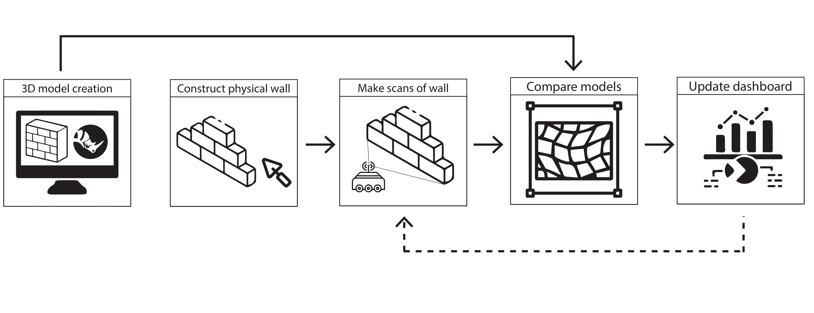

# Progress Pilot
## Insights in 3D data acquisition and autonomous construction progress tracking

Welcome to our project repository! This README provides a complete guide to the workflow, installation, and contents of the repository.

---



## Workflow Overview

This project is organized into four main tasks, each contributing to the final data processing and result generation. The workflow handles Robotic Control, Sensor data acquisition, Data modeling, and Result visualization, as shown below:

### 1. **Robotic Control**
   This task is focused on the management of robotic systems and their interactions with the environment. It covers the acquisition of data through sensors, as well as control of robotic movements during data collection. While this task isn't fully detailed in the provided script, the project assumes the robot captures point cloud data, potentially from 3D sensors like LIDAR or cameras.

   **Functions/Steps:**
   - Acquisition of sensor data.
   - Control of the robotic system to ensure data is captured efficiently.

Note: This code should be run individually within the MIRTE Control

### 2. **Sensor Data** 
   Sensor data acquisition deals with gathering and loading the raw point cloud data from the scan locations. This involves loading the `.ply` files from a specified directory and visualizing the data for initial inspection. The point clouds are then processed to improve quality and consistency before further analysis.

   **Functions/Steps:**
   - Loading of point cloud data using `pcd.load_pcd()`.
   - Visualization of loaded point clouds with `pcd.visualize()`.
   - Correction of colors to ensure consistency using `pcd.colorize()`.

Note: This code should be run individually with a RealSense device connected 

### 3. **Data Modeling** 
   In this task, the point cloud data is processed, transformed, and modeled to create a unified representation of the scanned environment. This includes applying geometric transformations, removing unwanted elements, and downsampling the data for more efficient processing. The visual output is used to check the alignment, registration, and quality of the processed data. Additionally, the results are written to CSV files for further analysis and reporting. 
   
   Since this step is part of the main functionality of the code these steps are further elaborated on in their respective readme.md. 

#### 3.1 Pointcloud processing

#### 3.2 Comparing with BIM model


### 4. **Dashboard** Hier komt mark zijn zooi met dashboard 
   Once the data has been processed and cleaned, this task focuses on visualizing the results with graphs.  

   
Note: This could should be run indivudally due to limitations with importing csv files  MARK SCHRIJF HIER BIJ WAT ER NOU GEBEURD 
---

## Installation 

To set up your environment, first install the required dependencies using the `requirements.txt` file:

```bash
pip install -r requirements.txt
