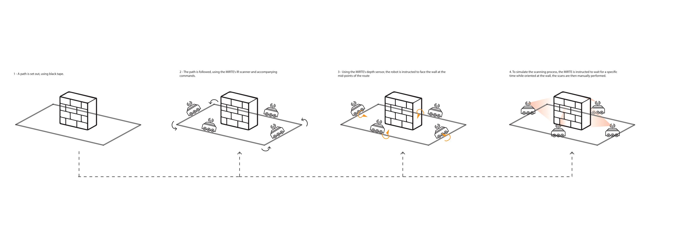

# Mirte Robot Control Script

This Python script controls a Mirte robot for line-following and wall scanning tasks. It includes emergency stop functionality, distance and time logging, and the ability to celebrate after completing a specified number of scans.


---



## Features

- Line-following capabilities using infrared sensors.
- Wall scanning functionality with distance logging.
- Emergency stop mechanism to prevent collisions.
- Celebration spin when the scanning goal is reached.
- Scan logs saved to a CSV file for further analysis.

## Requirements

- Python 3.6 or higher
- `mirte_robot` library (ensure it is installed and configured for your hardware)
- Access to the Mirte robot hardware
- CSV module (part of Python's standard library, no installation required)
- Time module (part of Python's standard library, no installation required)

## Installation

1. Clone this repository:
   ```bash
   git clone https://github.com/yourusername/mirte-robot-control.git
   cd mirte-robot-control
