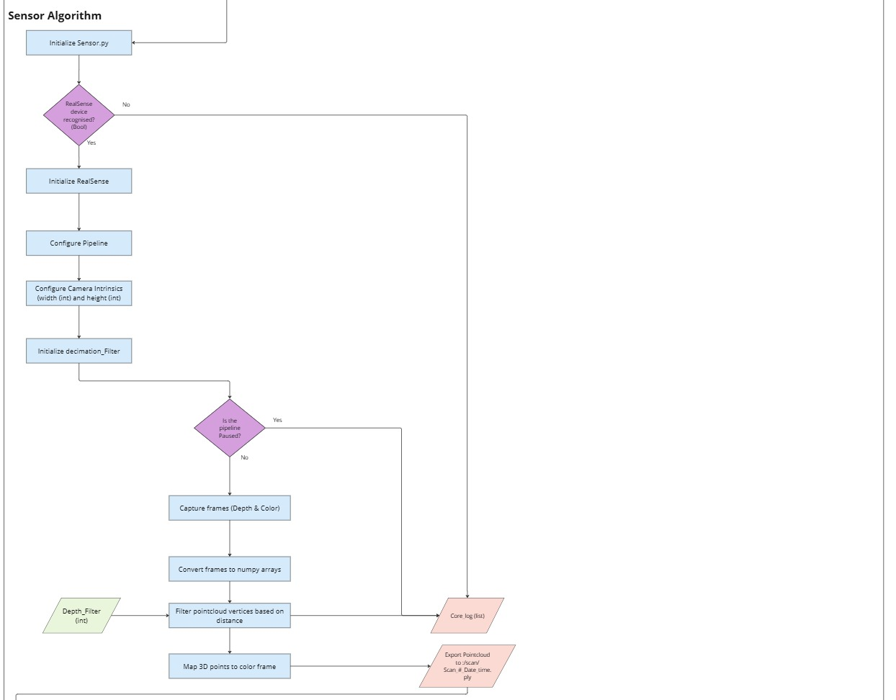

# `sensor.py` - Sensor Data Acquisition

## Overview

The `sensor.py` file is responsible for acquiring raw point cloud data from a 3D sensor, such as an Intel RealSense camera. It handles sensor initialization, data collection, and saving of the data in the `.ply` format for further processing. The sensor can capture 3D point clouds from the environment, which are crucial for creating accurate models of the scanned area. 

### Features:
- **Sensor Initialization**: Initializes the 3D sensor (RealSense or other).
- **Data Capture**: Captures point cloud data from the sensor.
- **Saving Data**: Saves the captured data in `.ply` format for further processing.
- **Real-time Visualization**: Optionally visualizes the point cloud as it is being captured.
  
### Functions/Methods:
- **`initialize_sensor()`**: Initializes the sensor and sets up the camera parameters.
- **`capture_point_cloud()`**: Captures a single point cloud frame from the sensor.
- **`save_point_cloud(filename)`**: Saves the captured point cloud data to the specified file.
- **`visualize_point_cloud()`**: (Optional) Visualizes the point cloud in real-time.

 ### Test files:
In this folder there is also a set of Filtered test .ply files that were used in the algorithm 

